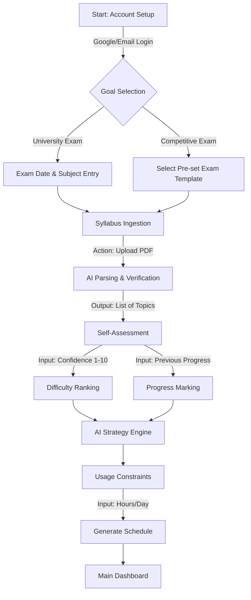

# Task 1.2: User Personas and Interaction Flow

**Role:** UX Strategy & Research  
**Date:** January 2026  
**Project:** SmartStudy AI Planner

---

## 1. User Personas

To ensure the application meets diverse needs, we focus on two extreme users: the student who needs urgent help and the student who wants optimization.

### 👤 Persona A: "The Procrastinator" (Arjun)
> *"I have 5 days left and 10 chapters to cover. Just tell me what to skip and what to study to pass."*

*   **Demographics:** B.Tech Student, 3rd Year. Often skips classes.
*   **Pain Points:**
    *   Overwhelmed by the sheer volume of syllabus.
    *   Cannot prioritize; spends too much time on easy/low-weight topics.
    *   Panic-induced paralysis.
*   **What this Persona Needs:**
    *   **Red Alert UI:** Clear indicators of urgency (Red/Orange/Green).
    *   **The "Pass Mode":** A feature that acts as a triage, cutting out non-essential topics.
    *   **Automated Rescheduling:** Doesn't want to drag-and-drop. Wants a "Fix It" button when he misses a task.

### 👤 Persona B: "The High-Achiever" (Sneha)
> *"I finished the syllabus once. Now I need to make sure I don't forget Chapter 1 while studying Chapter 10."*

*   **Demographics:** Competitive Exam Aspirant (GATE/UPSC). Disciplined routine.
*   **Pain Points:**
    *   The "Forgetting Curve" (recalling old concepts).
    *   Balancing revision with new learning.
    *   Need for data to confirm she is on track.
*   **What this Persona Needs:**
    *   **Spaced Repetition (SRS):** The AI must schedule reviews optimally (1 day, 3 days, 7 days later).
    *   **Analytics:** Detailed graphs showing "Retention Strength" vs. "Sylabus Coverage".
    *   **Focus Mode:** Distraction-free timer interface.

---

## 2. Primary User Flow (The "Happy Path")

This flow represents the ideal journey from zero to a generated schedule.

### Text-Based Step-by-Step Breakdown

1.  **Account Setup & Goal**: minimal friction. "Are you studying for a University Exam or Competitive?"
2.  **Syllabus Parsing (The "Magic" Moment)**:
    *   User uploads `Syllabus.pdf`.
    *   AI extracts topics.
    *   **Interaction:** User sees a list meant for verification. "We found 15 topics. Is this correct?" (User confirms).
3.  **The "Knowledge Audit"**:
    *   Before planning, the system asks: "How comfortable are you with *Thermodynamics*?" (Slider 1-10).
    *   This data is crucial for the Difficulty Weighting algorithm.
4.  **Schedule Generation**: The user is presented with the **Today View** (Focus Mode).

---

## 3. The "Reschedule" Edge Case Flow

What happens when life happens? This is where the AI proves its value over a paper timetable.

### Scenario: The Missed Session
Arjun was supposed to study "Calculus" on Tues, 4 PM - 6 PM. He missed it.

**Step 1: Detection**
*   The system notices no "Mark as Done" action occurred by midnight.
*   **Notification:** *"Hey Arjun, looks like we missed Calculus today. No stress!"*

**Step 2: AI Suggestion (The Interaction)**
*   The Dashboard shows a **"Schedule Conflict"** alert next morning.
*   **AI Button:** "Reschedule Missed Tasks"
*   **AI Logic:**
    *   *Option A:* Squeeze it into "Free Time" on Saturday.
    *   *Option B:* Increase daily study time by 30 mins for the next 4 days.
    *   *Option C (The Procrastinator Special):* Drop the lowest weightage topic from the future plan to make space.

**Step 3: Resolution**
*   User taps "Option A".
*   Plan regenerates instantly.

---

## 4. Mobile Responsiveness Strategy
*   **Thumb Zone:** The "Mark Done" and "Start Timer" buttons must be at the bottom of the screen.
*   **Card UI:** Each topic is a "Card" that can be swiped away (Done) or tapped for details.
