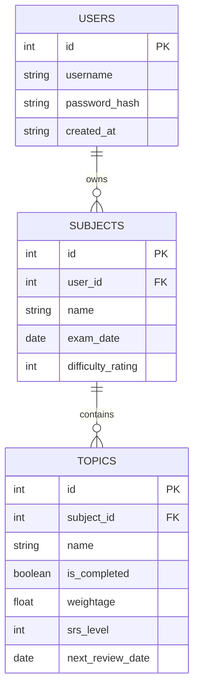

# Task 3.2: SQL Database Schema Design

**Role:** Database Architect  
**Date:** January 2026  
**Project:** SmartStudy AI Planner  
**Database System:** SQL (SQLite for Dev / PostgreSQL for Prod)  
**ORM Strategy:** SQLAlchemy (Standard for FastAPI)

---

## 1. Overview and Rationale

We are retaining the **Relational Model** (SQL) for data consistency and distinct relationships between Users, Subjects, and Topics. 

*   **Why SQL?** Great for structured relations (One User -> Many Subjects -> Many Topics).
*   **Why SQLAlchemy?** It abstracts the raw SQL, allowing us to switch between SQLite and PostgreSQL easily without rewriting code.

---

## 2. Entity-Relationship Diagram (ERD)

---

## 3. Table Definitions (SQLAlchemy Models)

### Table: `users`
| Column | Type | Constraints | Description |
| :--- | :--- | :--- | :--- |
| `id` | Integer | PK, Auto | Unique User ID |
| `username` | String | Unique, Not Null | Login handle |
| `hashed_password` | String | Not Null | Scrypt/Bcrypt Hash |
| `is_active` | Boolean | Default True | For soft bans/deactivation |

### Table: `subjects`
| Column | Type | Constraints | Description |
| :--- | :--- | :--- | :--- |
| `id` | Integer | PK, Auto | Subject ID |
| `user_id` | Integer | FK(`users.id`) | Optimization: Index this |
| `name` | String | Not Null | e.g., "Physics" |
| `difficulty` | Integer | 1-10 | User self-assessment |
| `exam_date` | Date | Not Null | Driver for urgency algos |

### Table: `topics`
| Column | Type | Constraints | Description |
| :--- | :--- | :--- | :--- |
| `id` | Integer | PK, Auto | Topic ID |
| `subject_id` | Integer | FK(`subjects.id`) | Cascade Delete |
| `name` | String | Not Null | e.g., "Thermodynamics" |
| `status` | Boolean | Default False | True = Done |
| `weightage` | Float | Default 1.0 | 1.5 = High Yield |
| `srs_level` | Integer | Default 0 | For Spaced Repetition (0-5) |

---

## 4. Migration Plan (From Prototype to Production)

Currently, our `database.py` uses raw SQL strings. For the Full-Stack app, we will assume:

1.  **Alembic** for managing schema migrations (e.g., adding the `user_id` column).
2.  **Foreign Keys**: We must ensure strictly that a Topic belongs to a Subject, and a Subject belongs to a User. This prevents "User B" from seeing "User A's" exams.

### Key Changes from Current Prototype
1.  **Multi-Tenancy**: Added `user_id` to `Subjects` table.
2.  **SRS Support**: Added `srs_level` and `next_review_date` to `Topics` table to support the "Flashcard/Review" feature mentioned in objectives.
